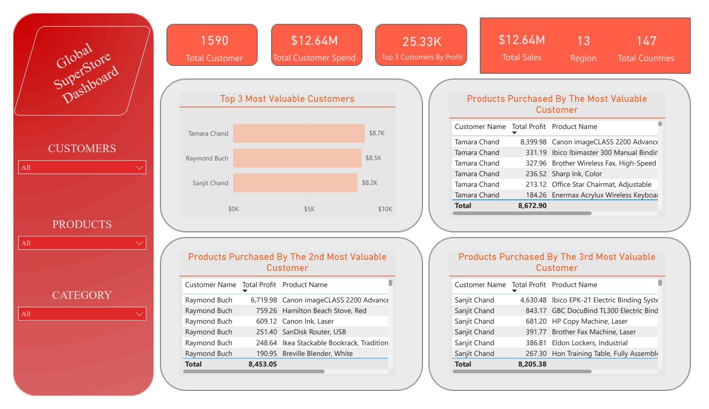

# Global-Superstore-Sales-2014

## Introduction
This contains the dataset of Global Superstore dataset, a comprehensive record of sales transactions from a global online retailer based in New York. To draw out meaningful insights, I dived into the rich dataset using Power BI. 
 ### Power BI Concepts applied:
- DAX
- Custom Column
- Filters
- Data Modelling

## Problem Statement
1. What are the three countries that generated the highest total profit for Global Superstore in 2014?
2. Identify the 3 subcategories with the highest average shipping cost in the United States.
3. Assess Nigeria’s profitability (i.e., total profit) for 2014. How does it compare to other African countries?
4. Identify the product subcategory that is the least profitable in Southeast Asia.
5. Which city is the least profitable (in terms of average profit) in the United States?
6. Which product subcategory has the highest average profit in Australia?
7. Who are the most valuable customers and what do they purchase?

## Data Cleaning
This dataset was cleaned by using a power query in power bi. 
In the ‘Orders’ table, I removed the postal code column, then changed some of the column data type, I added a custom column to calculate the delivery time, then I added Year column. In the ‘People’ table, I made the first row the header and filtered the rows to remove the null values. In the ‘Returns’ table, I made the first row the header.

## Data Modelling

Power BI automatically connected related tables resulting in a star schema model. The fact table is the 'Order' table. The remaining two dimension tables are the 'Return' table and 'People' table. The two tables are connected to the 'Order' table via the common columns: 'Order ID' and ‘Region’ respectively. 

## Data Visualization

- From the dashboard, it is observed that the top 3 countries that generated the highest revenue are the United States, India and China.
- Total profit made = $1.47M, total profit made in 2014 = $504.17K
- Top three products with the highest total profit for each country.
- In USA, they include:
  - Canon imageClass 2200 Advanced Copier generating profit of $15,679.96
  - Hewlett Packard LaserJet 3310 Copier generating profit of $3,623.94  
  - GBC DocuBind TL300 Electric Binding System generating profit of $1,910.59
- In India, they include:
   - Sauder Classic Bookcase, Traditional with profit of $2,419.65
   - Cisco Smartphone with Caller ID with profit of $1,609.38
   - Hamilton Beach Refrigerator, Red with profit of $1,440.24
- In China, they include:
  - Sauder Classic Metal, Traditional with profit of $1,463.07
   - Bush Classic Bookcase, Mobile with profit of $1,220.52
   - HP Copy Machine, Colour with profit of $1,196.13
- Top 3 Subcategories with the Highest Average Shipping Cost In the US includes Copiers, Machines and Tables.
- Global Superstore is making a loss in Nigeria, with a total negative profit of $-23,285.19 even when it sold the highest quantity of products. The factors include the shipping cost and the discount rate. Nigeria’s shipping cost and discount is the highest when compared to other African countries. 
- The Subcategory that is the least profitable in SouthEast Asia is the Tables. It has a total negative profit of $-18,618.31.
- In the United States of America, Lancaster is the least average profitable city. It has the lowest average profit because it had one of the smallest sales
- In Australia, the product subcategory with the highest average profit is Appliances but the one with the highest profit is the Copiers
- Top 3 most Valuable Customers are
   - Tamara Chand
   - Raymond Buch
   - Sanjit Chand

## Conclusions & Recommendations
To increase sales, Global Superstore should consider hiring more salespersons in the US, China and India. Then, stop discount purchases in African countries or allow a little discount only based on a confirmed referral(customers who bought multiple products).
Do in-depth analysis on the least profitable cities in the US to understand why there is low sales.
Stop the sales of tables in Indonesia, focus on the other Asian regions.
Push for customer reviews in all regions to understand why there is high, little or no sales.
Have a reward system for the top best purchasing customers.

